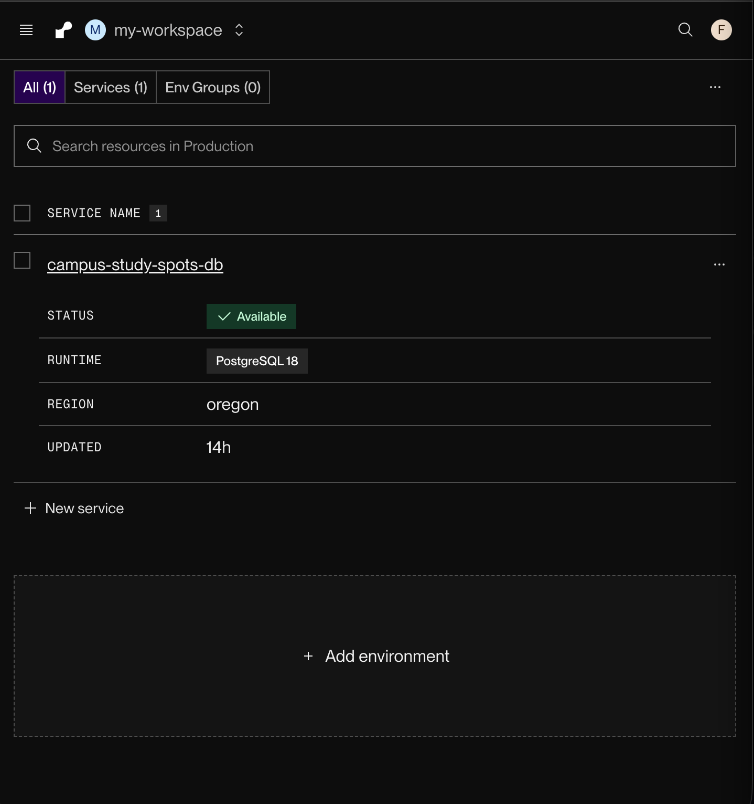

# WEB103 Project 2 - *Campus Study Spots*

Submitted by: **Fiyinfoluwa Somorin**

About this web app: **Campus Study Spots is a database-backed listicle that helps students compare five places to study on campus. Users can browse study spots and open a detailed page showing each spot's location, noise level, best use, seating, hours, and power outlet availability.**

Time spent: **6** hours

Live app: [https://campus-study-spots.onrender.com](https://campus-study-spots.onrender.com)

## Required Features

The following **required** functionality is completed:

<!-- Make sure to check off completed functionality below -->
- [x] **The web app uses only HTML, CSS, and JavaScript without a frontend framework**
- [x] **The web app is connected to a PostgreSQL database, with an appropriately structured database table for the list items**
  - [x] **NOTE: Your walkthrough added to the README must include a view of your Render dashboard demonstrating that your Postgres database is available**
  - [ ] **NOTE: Your walkthrough added to the README must include a demonstration of your table contents. Use the psql command `SELECT * FROM study_spots;` to display your table contents.**

The following **optional** features are implemented:

- [ ] The user can search for items by a specific attribute

The following **additional** features are implemented:

- [x] Each study spot has a unique detail-page URL
- [x] Detail pages display all fields retrieved from PostgreSQL
- [x] The app includes custom not-found states for invalid pages and study spots
- [x] The responsive card layout works on smaller screens
- [x] The app provides database-backed JSON API endpoints

## Video Walkthrough

Here's a walkthrough of implemented required features:

GIF created with CloudConvert

### Render PostgreSQL Database

## Notes

The app uses a vanilla HTML, CSS, and JavaScript frontend with an Express backend. Express retrieves study spot data from a Render PostgreSQL database through parameterized queries and exposes it through JSON API endpoints. One challenge was configuring the deployed Render web service with the database's internal connection URL.

## License

Copyright 2026 Fiyinfoluwa Somorin

Licensed under the Apache License, Version 2.0 (the "License"); you may not use this file except in compliance with the License. You may obtain a copy of the License at

> http://www.apache.org/licenses/LICENSE-2.0

Unless required by applicable law or agreed to in writing, software distributed under the License is distributed on an "AS IS" BASIS, WITHOUT WARRANTIES OR CONDITIONS OF ANY KIND, either express or implied. See the License for the specific language governing permissions and limitations under the License.
